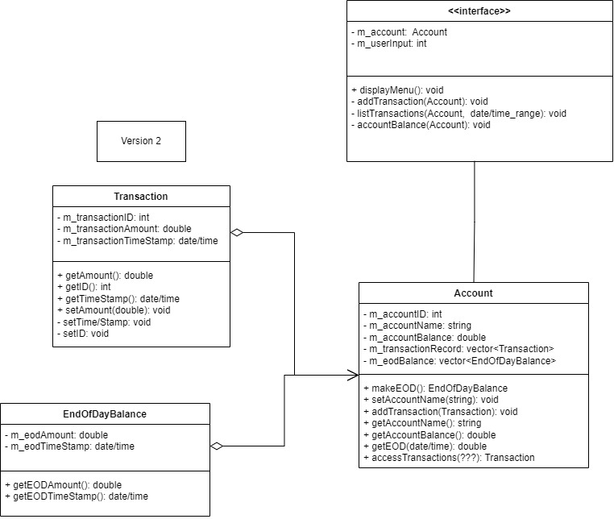

# Welcome to the Strongpaw Personal Finance Project

## This is a first attempt at a well-written C++ program

- Author: Matt Garcia
- Email: strongpawcoding@gmail.com

## The plan so far

### 8/17/2023

This was my second try at a class diagram. I did my best to plan it out before I put code on the screen!

### 8/18/23

I am running into the most issues with how the program will know that it is a new day.
I did not foresee this, but it looks like a calendar program will be needed.
